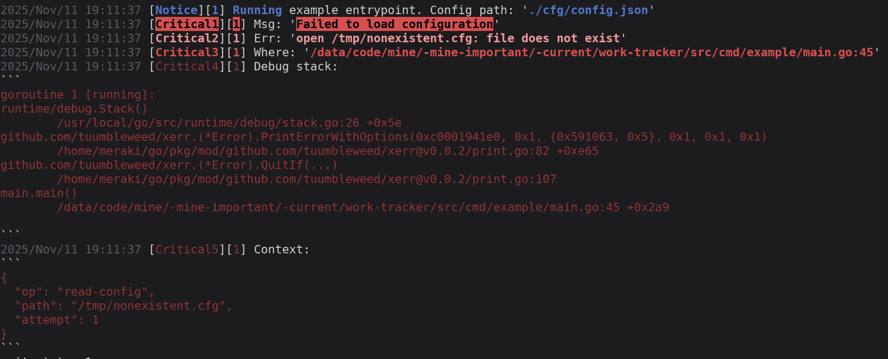

# xerr

`xerr` is a small, portable error wrapper for Go. It records a message, cause, call-site (`file:line`), and a safely stringified context, and travels cleanly through logs, JSON, and databases.

## Preview

  

## Features

- Structured fields: `Msg`, `Where`, `Context`, `Err` (+ `ErrStr`).
- Smart context formatting (string/bytes/JSON/Stringer) with truncation.
- JSON/GORM aware: syncs `Err` ↔ `ErrStr` (custom marshal, `BeforeSave` / `AfterFind`).
- Colorized printing helpers (`error` / `warning` / `skip`) powered by **tintlog**.
- Large contexts are capped to keep outputs sane.

## Why

- Keep rich diagnostics attached to the error without leaking huge blobs.
- Preserve human-friendly output in terminals and machine-friendly JSON for logs/DBs.
- Keep dependencies minimal and the API tiny.

## Status

Stable for everyday use; API surface is intentionally small.
